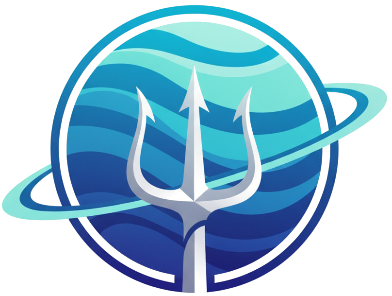
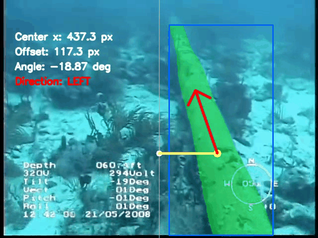
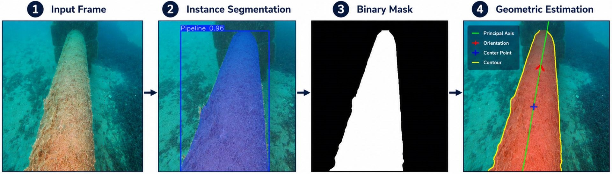
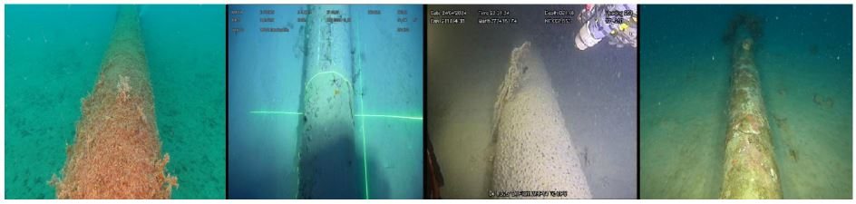
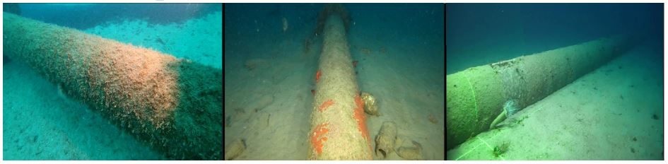
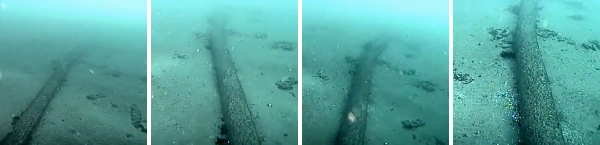
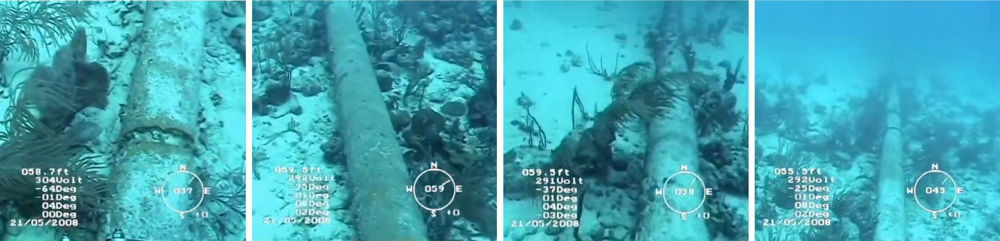
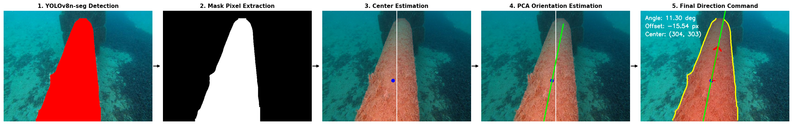

<div align="center">



# Underwater Pipeline Geometric Perception
### Lightweight Segmentation-Based Underwater Pipeline Perception for Embedded AI Deployment

**Deployment-oriented underwater perception pipeline for extracting navigation-relevant geometric information using YOLOv8n instance segmentation, ONNX inference, and PCA-based geometric estimation.**

[](https://python.org)
[](https://ultralytics.com)
[](https://onnxruntime.ai)
[](LICENSE)
[](https://universe.roboflow.com/hamzaghitri/pipeline-body)
[](#)
[](#)

<br/>

📄 [IEEE Paper](#) &nbsp;·&nbsp;
📦 [Dataset (Roboflow)](https://universe.roboflow.com/hamzaghitri) &nbsp;·&nbsp;
🚀 [USCG Evaluation Dataset](https://github.com/7amzaGH/Underwater-Pipeline-Geometric-Perception) &nbsp;·&nbsp;

<br/>

Lightweight underwater perception pipeline operating on monocular underwater imagery for image-plane pipeline center alignment and orientation estimation.



</div>

---

# Table of Contents

- [Overview](#overview)
- [System Architecture](#system-architecture)
- [Embedded Deployment](#embedded-deployment)
- [Datasets](#datasets)
- [Geometry Extraction](#geometry-extraction)
- [Results](#results)
  - [Segmentation Performance](#segmentation-performance)
  - [Geometry Estimation Performance](#geometry-estimation-performance)
  - [Embedded Deployment Performance](#embedded-deployment-performance)
  - [Deployment Reconstruction Ablation](#deployment-reconstruction-ablation)
- [Quick Start](#quick-start)
- [Usage in Python](#usage-in-python)
- [Repository Structure](#repository-structure)
- [Citation](#citation)
- [Acknowledgments](#acknowledgments)
- [License](#license)

---

# Overview

Reliable underwater pipeline perception is a fundamental requirement for subsea robotic inspection missions. However, underwater environments introduce severe visual degradation including:

- turbidity
- illumination inconsistency
- color attenuation
- marine biofouling
- low-contrast boundaries

This repository presents a lightweight deployment-oriented underwater perception pipeline for extracting navigation-relevant geometric information from monocular underwater imagery.

The framework combines:

- **YOLOv8n instance segmentation**
- **deployment-oriented ONNX inference**
- **INT8 embedded deployment**
- **PCA-based geometric estimation**

to estimate:

- image-plane pipeline center alignment
- dominant pipeline orientation
- directional alignment cues

under real-world underwater conditions.

The project focuses specifically on:

> lightweight embedded underwater perception

rather than full robotic autonomy, SLAM, or control systems.

---

# System Architecture

<p align="center">
  
</p>

The proposed pipeline operates in four sequential stages:

### 1. Image Acquisition
Monocular underwater RGB frames are captured and resized to 640 × 640 pixels.

### 2. Instance Segmentation
YOLOv8n-seg predicts pixel-level pipeline masks directly from underwater imagery.

### 3. Deployment-Oriented Mask Reconstruction
ONNX outputs are reconstructed using:
- prototype-mask decoding
- confidence filtering
- bounding-box-guided cropping

to preserve geometric consistency during deployment inference.

### 4. Geometry Extraction
PCA-based geometric estimation extracts:
- image-plane center position
- orientation angle
- directional alignment

from the reconstructed segmentation mask.

---

# Embedded Deployment

The trained YOLOv8n-seg model was exported to ONNX format and optimized for embedded inference on the:

## Qualcomm RB3 Gen 2 (QCS6490)

Deployment pipeline:

```text
PyTorch FP32
    ↓
ONNX Export
    ↓
INT8 Quantization
    ↓
Qualcomm AI Hub Compilation
    ↓
Hexagon NPU Deployment
````

The deployed INT8 model achieved:

| Metric            | Value                |
| ----------------- | -------------------- |
| Inference Latency | 8.8 ms               |
| Throughput        | 113.6 FPS            |
| Processing Unit   | Qualcomm Hexagon NPU |
| NPU Offload       | 100%                 |

The complete PCA-based geometric extraction stage adds negligible computational overhead (< 0.5 ms/frame).

---

# Datasets

## Training Dataset

The segmentation training dataset was derived from the publicly available **Cijevi underwater pipeline dataset** and manually re-annotated for instance segmentation.

### Characteristics

* 618 curated underwater pipeline images
* polygon-based segmentation masks
* varying turbidity and illumination conditions
* multiple viewing angles
* 640 × 640 resolution

### Public Dataset

**Roboflow Universe**
The custom evaluation dataset is publicly available on Roboflow : **[Underwater-Pipeline-Dataset](https://universe.roboflow.com/neptunet-bewas/pipeline-body)**

<p align="center">
  <a href="https://universe.roboflow.com/hamzaghitri/pipeline-body">
    </img>
  </a>
</p>

Rpresentative Underwater Pipeline images under varying underwater conditions from the Cijevi dataset, showing the range of turbidity levels, illumination changes, and biofouling states present in the data.
<p align="center">
  
</p>

Rpresentative Underwater Pipeline images captured from different viewing angles (RIGHT, LEFT, STRAIGHT)
<p align="center">
  
</p>
---

## External Evaluation Dataset A

Derived from publicly available:

### U.S. Coast Guard underwater inspection footage

Characteristics:

* severe turbidity
* seabed clutter
* low contrast
* non-centered pipelines

Public dataset:
<p align="center">
  <a href="https://universe.roboflow.com/hamzaghitri/underwater-pipeline-uscg">
      </img>
  </a>
</p>

<p align="center">
  
</p>

---

## External Evaluation Dataset B

Derived from real-world ROV underwater inspection footage released by:

### Hibbard Inshore

Characteristics:

* heavy underwater degradation
* biofouling
* varying camera orientations
* cluttered seabed conditions

Public dataset:
<p align="center">
  <a href="https://universe.roboflow.com/hamzaghitri/underwater-pipeline-hibbard">
      </img>
  </a>
</p>

<p align="center">
  
</p>

---

# Geometry Extraction

Navigation-relevant geometric information is extracted directly from the segmentation mask using PCA-based geometric estimation.

<p align="center">
  
</p>

The pipeline estimates:

| Parameter   | Description                         |
| ----------- | ----------------------------------- |
| `xc`        | image-plane pipeline center         |
| `α`         | dominant pipeline orientation angle |
| `direction` | LEFT / STRAIGHT / RIGHT             |

### Pipeline Center Estimation

```python
xc = mean(x_foreground_pixels)
```

### Orientation Estimation

Principal Component Analysis (PCA) is applied to foreground mask pixels:

```python
angle = atan2(dx, -dy)
```

### Direction Classification

```python
RIGHT      if α > +5°
LEFT       if α < -5°
STRAIGHT   otherwise
```

---

# Results

# Segmentation Performance

| Dataset             | Model | Precision | Recall | mAP@0.5 | mAP@0.5:0.95 |
| ------------------- | ----- | --------- | ------ | ------- | ------------ |
| Internal Test Set   | FP32  | 0.986     | 1.000  | 0.995   | 0.946        |
| Internal Test Set   | ONNX  | 0.985     | 1.000  | 0.995   | 0.945        |
| External Test Set A | FP32  | 1.000     | 1.000  | 0.995   | 0.842        |
| External Test Set A | ONNX  | 1.000     | 1.000  | 0.995   | 0.827        |
| External Test Set B | FP32  | 0.990     | 0.995  | 0.994   | 0.845        |
| External Test Set B | ONNX  | 0.990     | 0.995  | 0.993   | 0.852        |

The results demonstrate robust cross-domain segmentation performance under challenging underwater conditions.

---

# Geometry Estimation Performance

| Dataset             | Model | Center Error (px) | Angle Error (°) | Direction Accuracy |
| ------------------- | ----- | ----------------- | --------------- | ------------------ |
| Internal Test Set   | FP32  | 3.12              | 1.00            | 99.52%             |
| Internal Test Set   | ONNX  | 3.89              | 0.99            | 99.52%             |
| External Test Set A | FP32  | 2.92              | 0.86            | 100.00%            |
| External Test Set A | ONNX  | 3.03              | 0.88            | 100.00%            |
| External Test Set B | FP32  | 1.79              | 0.55            | 100.00%            |
| External Test Set B | ONNX  | 1.71              | 0.54            | 100.00%            |

Across all evaluation datasets, the proposed framework maintained:

* sub-degree orientation estimation accuracy
* stable directional consistency
* minimal degradation after ONNX deployment

---

# Embedded Deployment Performance

| Model | Hardware           | Processing Unit | Latency | FPS   |
| ----- | ------------------ | --------------- | ------- | ----- |
| FP32  | NVIDIA Tesla T4    | GPU             | 9.29 ms | 107.7 |
| INT8  | Qualcomm RB3 Gen 2 | NPU             | 8.80 ms | 113.6 |

The deployment results demonstrate that lightweight underwater perception can operate in real-time on embedded AI hardware.

---

# Deployment Reconstruction Ablation

An ablation study evaluated the importance of deployment-side mask reconstruction during ONNX inference.

| Decoding Strategy  | Center Error (px) | Angle Error (°) | Direction Accuracy |
| ------------------ | ----------------- | --------------- | ------------------ |
| No box-guided crop | 72.59             | 49.02           | 41.71%             |
| Box-guided crop    | 1.71              | 0.54            | 94.97%             |

This demonstrates that:

> correct deployment-side mask reconstruction is critical for preserving downstream geometric consistency.

---

# Quick Start

## 1. Clone Repository

```bash
git clone https://github.com/7amzaGH/Underwater-Pipeline-Geometric-Perception.git
cd Underwater-Pipeline-Geometric-Perception
```

---

## 2. Install Dependencies

```bash
pip install -r requirements.txt
```

---

## 3. Download Model Weights

Place:

* `best.pt`
* `best.onnx`

inside:

```text
models/
```

---

## 4. Run PyTorch Inference

```bash
python scripts/run_pytorch_inference.py \
    --model models/best.pt \
    --source demo/demo.mp4
```

---

## 5. Run ONNX Inference

```bash
python scripts/run_onnx_inference.py \
    --model models/best.onnx \
    --source demo/demo.mp4
```

---

## 6. Evaluate Geometry

```bash
python scripts/evaluate_geometry.py
```

---

# Usage in Python

```python
from src.geometry.pca import estimate_pipeline_geometry
from src.onnx_inference.inference import ONNXPipeline

pipeline = ONNXPipeline(
    model_path="models/best.onnx",
    conf_threshold=0.5
)

results = pipeline.predict(frame)

geometry = estimate_pipeline_geometry(results["mask"])

print(geometry)
```

---

# Repository Structure

```text
Underwater-Pipeline-Geometric-Perception/
│
├── assets/
│   ├── main_offline.py     <- Offline 
│   ├── main_live.py        <- Live 
│   ├── detect.py           <- YOLOv8n inference (PyTorch & ONNX)
│   ├── geolocation.py      <- 
│
├── models/
│   └── README.md           <- Models note

│
├── src/
│   ├── segmentation/
│   ├── geometry/
│   ├── onnx_inference/
│   ├── visualization/
│   └── utils/
│
├── scripts/
│   ├── train.py
│   ├── export_onnx.py
│   ├── run_onnx_inference.py
│   ├── evaluate_segmentation.py
│   ├── evaluate_geometry.py
│   └── benchmark_runtime.py
│
├── notebooks/
│   ├── geometry_demo.ipynb
│   └── evaluation_analysis.ipynb
│
├── paper/
│   └── paper.pdf
│
├── requirements.txt
├── LICENSE
└── README.md
```

---

# Citation

If you use this work in your research, please cite:

```bibtex
@article{ghitri2026pipeline,
  title   = {Lightweight Underwater Pipeline Geometric Perception for Embedded AI Deployment},
  author  = {Ghitri, Hamza and Belgrana, Fatima Zohra},
  year    = {2026},
  journal = {IEEE Conference Submission}
}
```

---

# Acknowledgments

* [Ultralytics YOLOv8](https://github.com/ultralytics/ultralytics)
* [Cijevi Underwater Pipeline Dataset](https://universe.roboflow.com/boris-gasparovic/cijevi)
* Qualcomm AI Hub
* ONNX Runtime

---

# License

MIT License — see [LICENSE](LICENSE) for details.

---

<div align="center">
  <sub>Lightweight embedded underwater perception for subsea robotic inspection.</sub>
</div>
```
